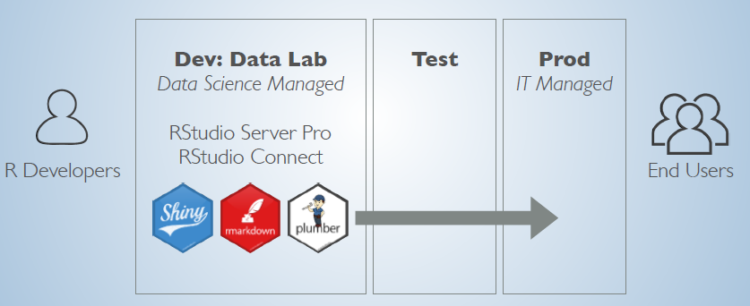

```{r setup, include=FALSE}
options(htmltools.dir.version = FALSE)
```

# A propos
.subtitle[Courte introduction]
</br>
### Utilisateur de `r icon::fa_r_project()` depuis 6 ans
</br>    
###  RTE (Réseau de Transport d'Electricité)<sup>1</sup> 
</br>
### Depuis + d'un an, entre autres, en appui autour des sujets/projets `r icon::fa_r_project()` 
</br>    
.pull-left[
.center[
### `r icon::fa_github()`
@cderv
]
]

.pull-right[
.center[
### `r icon::fa_twitter()`
@chrisderv
]
]

.footnote[
[1] cette présentation n'est pas dans un cadre officiel - juste un partage personnel. 
]

???

Rattaché au niveau du SI dans les démarches d'open data interne.

Sujets:
- Développement de packages
- Mise en place datalab
- Conseil développement et expertise

---

# `r icon::fa_r_project()` en entreprise
.subtitle[C'est pas comme à la maison]

.pull-left[
### Poste de travail </br> pas toujours adapté
+ Pas son poste perso

+ Offre bureautique, non scientifique

+ Sécurité = Limitation</br>(Proxy, non admin, ...)
]

.pull-right[
### Cadre technique de l'entreprise contraignant
+ Règle pour le déploiement d'application en production

+ `r icon::fa_r_project()` non référencé dans _les technologies validées_

+ Pas (encore ?) de cloud à disposition
]
</br>
</br>
.box[
.center[ 
**Comment améliorer le cadre de travail ?**  
**Contribuer à la transformation numérique de l'entreprise ?** 
]
]

???

Pas de github, pas de travis, pas de codecov, etc... 

Pas open source donc pas gratuit

Je n'installe pas ce que je veux malheureusement 

Cadre limité

---

# Les grandes idées

.subtitle[pour un 'datalab']

### Mutualisé
+ Collaboration entre équipes sur des projets
+ Accès aux données l'entreprise
+ Partage de la ressource de calcul

--

### Prêt à l'emploi
+ Juste à se connecter
+ Pas d'installation, pas de configuration
+ Permettre à des débutants d'utiliser `r icon::fa_r_project()` comme un outil de manipulation de donnée avancée

--

### Accompagné de services et solutions
+ Intégrer à d'autres solutions
+ Favoriser les packages internes adapté au cadre de l'entreprise
+ Offrir support & expertise 

???

+ Offrir un environnement d'étude et de développement **mutualisé** et **prêt à l'emploi** 
+ Proposer des **services en interne** pour les datascientists, chargés d'études et développeurs.

Pleins de possibilités sur le web (shinyapps.io, Rpubs, Github, Github pages, Travis, ...). Et en interne ?

Pourquoi ? Pour qui ?

Avantage: 
+ Déporté

Excel ++

---

# Mis en place 

.subtitle[Solution interne en mode serveurs]

.center[

```{r, results='asis', echo = FALSE}
cat(readLines("draw-io_embded.txt"))
```

### En constante évolution
]

???

+ 2 serveurs Rstudio Pro en cluster
+ 1 serveur RStudio Connect
+ Un miroir interne du CRAN, avec possibilité de publier des packages internes
+ Accès à "l'usine de développement" (Gitlab, Jenkins, Nexus, SonarQube)
+ Accès aux données de l'entreprise

---

# Admin R ?
.subtitle[S'adapter à un contexte technique d'entreprise]

.center[
```{r echo=FALSE, fig.height=5, fig.width=5}
set.seed(9456)
words <- c("NAS", "LDAP", "ACLv3", "KERBEROS", "ACLv4", "NTLM", "HTTP_PROXY", "Redhat", "PAM", "CLI",
           "ODBC", "DSN", "FreeIPA", "ODBA", "EXADATA", "SSL", "kinit", "Datacenter", "API", 
           "odbc.ini", "Rprofile.site", "Proxy", "Parquet", "Hive", "Impala", "Oracle")
# words <- sample(words, size = 30, replace = length(words) < 30)
freq <- sample(1:50, size = length(words), replace = TRUE)
wordcloud::wordcloud(words, freq, 
                     colors = RColorBrewer::brewer.pal(6,"Dark2"), 
                     random.color = TRUE, rot.per = 0.2,
                     scale =c(4, 1.5))
```
]

>  The R admin bridges the divide between IT operations and data science teams. 

[The R Admin is rad: A guide to professional R tooling and integration](https://www.rstudio.com/resources/videos/the-r-admin-is-rad-a-guide-to-professional-r-tooling-and-integration/) ( _rstudio::conf2018_ )

---
layout: true
# Retour d'expérience 
.subtitle[et réflexions...]
---
count:false
---

.left-column[
### Gestion des librairies
]

.right-column[

* Miroir CRAN interne car environnement offline

* Défi des dépendances systèmes </br>(Service [`sysreqs`](https://sysreqs.r-hub.io/) by RHub à la rescousse)

* Librairies partagées sur les serveurs (`R_LIBS_SITE`)

* Dépôt de packages internes
</br>
</br>
.center[
.color1[**Solution spécifique à `r icon::fa_r_project()` ou</br>même solution que les autres languages ?**]
</br>
</br>
.color1[**Quelles règles de gestions pour les mises à jour ?**]
]
]
---

.left-column[
### Gestion des librairies
### Intérêt de RStudio pro
]

.right-column[
* .color1[Multiple versions] de R

* .color1[Multi-sessions] pour les utilisateurs

* .color1[Authentification] d'entreprise

* .color1[Monitoring] des environnements

* .color1[Configuration de sessions R] pour le serveur

* Connectivité aux .color1[sources de données] facilitée

* .color1[Load Balancing]

* .color1[**Support**]
]

---

.left-column[
### Gestion des librairies
### Intérêt de RStudio pro
### Customisation
]

.right-column[
### Simplifier l'utilisation

+ Au niveau de `r icon::fa_r_project()` : _Rprofile.site_ et _Renviron.site_  
+ Au niveau des configurations RStudio

###  Améliorer l'expérience

+ Centralisation des accès aux données</br>(DSN, Kerberos, ...) 
+ Adapter l'onglet _connections_</br>
( [Connection contract](https://db.rstudio.com/advanced/contract))
+ Ajouter des fonctionnalités dans le contexte RTE </br>
( [Addins RStudio](https://rstudio.github.io/rstudio-extensions/rstudio_addins.html), [RStudio API](https://rstudio.github.io/rstudio-extensions/rstudioapi.html), [Snippet](https://rstudio.github.io/rstudio-extensions/rstudio_snippets.html))
+ .color1[**Template** interne]</br>( [Project template](https://rstudio.github.io/rstudio-extensions/rstudio_project_templates.html), [Rmarkdown templates](https://rstudio.github.io/rstudio-extensions/rmarkdown_templates.html))

.center[_https://rstudio.github.io/rstudio-extensions_]

]

???

Example stringi / R Oracle
Cran par default, etc...
---
layout: true
# Et à propos de `r icon::fa_r_project()` en prod ?

.subtitle[Favoriser le déploiement]
---
count: false
### Utilité du Datalab ?

---

### Utilité du Datalab ?

.center[
```{r echo=FALSE, fig.height=4, fig.width=6}
knitr::include_graphics("Bitcoin_example.PNG", dpi = NA)
```
.right[_Source: [R Admin - Talk rstudio::conf2018](https://github.com/nwstephens/r-admin-2018/blob/master/R-Admin-2018.pdf)_     
]
]

---

### Utilité du Datalab ?

```{r, echo = FALSE}

```

.right[_Source: [R Admin - Talk rstudio::conf2018](https://github.com/nwstephens/r-admin-2018/blob/master/R-Admin-2018.pdf)_
]

---
layout: true
# Et à propos de `r icon::fa_r_project()` en prod ?

.subtitle[Aujourd'hui à RTE]

---

.left-column[
### Principalement des apps shiny
]

.right-column[
+ Environnement de publication du datalab
  + Facile grâce à .color1[RStudio Connect]
  + app Shiny, dashboard, rapport et présentation 

+ Environnement dédié en data-center
  + Cas particuliers
  + Demande de revoir la conception

+ Docker ?
  + .color1[Standard DevOps] de l'entreprise
  + Nécessite une adaptation du contexte technique
]

---

.left-column[
### Principalement des apps shiny
### {packrat} à la rescousse
]

.right-column[
* `packrat.lock` généré dans le datalab

```r
# Générer uniquement le fichier packrat.lock
library(packrat)
.snapshotImpl(project = ".", 
*              snapshot.sources = FALSE)
```

* `packrat::restore()` dans l'environnement de déploiement le déploiement.

```r
library(packrat)
Sys.setenv(
  R_PACKRAT_CACHE_DIR = "<global-cache>",
  R_PACKRAT_SRC_DIR = "<global-src>"
)
set_opts(use.cache = TRUE, persit = FALSE)
restore()
packify() # packrat::on() automatique
```
.color1[Astuce]: un cache packrat pour accélérer le déploiement.

] 

---

.left-column[
### Principalement des apps shiny
### {packrat} à la rescousse
### {config} pour adapter entre environnements
]

.right-column[
* Un seul fichier à adapter uniquement : `config.yml`:

```yaml
default:
  db-name: "db-test.acme.com"
  log-folder: "./local-log-folder"
  
*production:
  db-name: "db-prod.acme.com"
  log-folder: "/mnt/shared-log-folder"
```
* Le code R n'a pas à être changé:

```r
db_name <- config::get("db-name")
log-path <- config::get("log-folder")
```

* Dans l'environnement de déploiement

```r
Sys.setenv(R_CONFIG_ACTIVE = "production")
```


]

---
layout: false
# De l'appui dans la communauté
.subtitle[Où trouver de l'aide]

###  _R Admin_ sur community.rstudio.com

https://community.rstudio.com/c/r-admin

> This category is for discussions about .color1[R in production], at scale, and in .color1[complex environments].

### _R for Entreprise_ sur le blog RViews

https://rviews.rstudio.com/categories/r-for-the-enterprise/
+ [Analytics Administration for R](https://rviews.rstudio.com/2017/06/21/analytics-administration-for-r/)
+ [Some Ideas for your Internal R Package](https://rviews.rstudio.com/2017/07/19/supporting-corporate-r-user-groups/)
+ [Enterprise Dashboards with R Markdown](https://rviews.rstudio.com/2018/05/16/replacing-excel-reports-with-r-markdown-and-shiny/)

### S'entraider entre francophone ?

Une communauté slack francophone : https://frama.link/r-grrr


---
class: inverse, center, middle, title-slide
count: false
# MERCI
