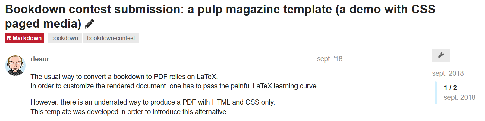
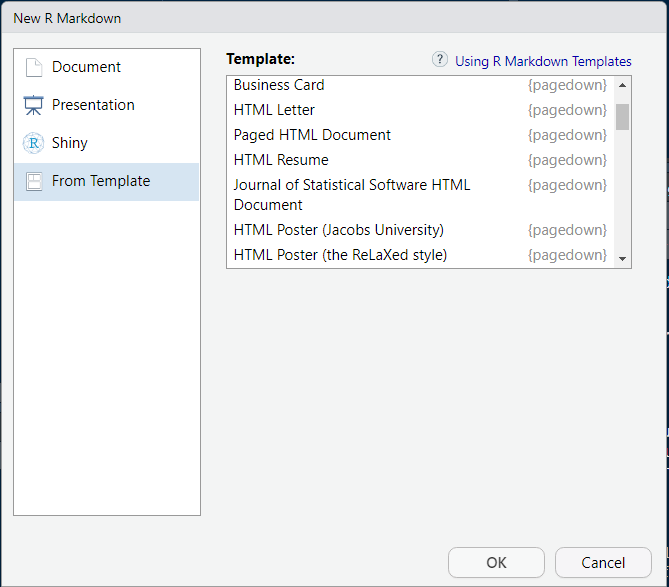

```{r setup, include=FALSE}
options(htmltools.dir.version = FALSE)
```

# A propos
.subtitle[Courte introduction]
</br>
### Utilisateur de `r icon::fa_r_project()` depuis 7 ans
</br>    
###  RTE (Réseau de Transport d'Electricité)<sup>1</sup> 
</br>
### R admin, developer advocate. En appui des projets et des utilisateurs. 
</br>    
.pull-left[
.center[
### `r icon::fa_github()`
@cderv
]
]

.pull-right[
.center[
### `r icon::fa_twitter()`
@chrisderv
]
]

.footnote[
[1] cette présentation n'est pas dans un cadre officiel - juste un partage personnel. 
]

???

License:
CC BY-SA 4.0
https://creativecommons.org/licenses/by-sa/4.0/

---
# Rmarkdown pour produire des PDF... mais sans Latex
.subtitle[Une idée farfelue ?]

.center[

]

---
# Rmarkdown pour produire des PDF... mais sans Latex
.subtitle[C'est possible !]
.pull-left[


]

.pull-right[

]
</br>
* Projet Demo `r icon::fa_github()`: [**RLesur/pulpdown**](https://github.com/RLesur/pulpdown)
* Utilisation ici du logiciel [Prince XML](https://www.princexml.com/)

---

# Pagedown
.subtitle[Des html paginés avec Rmarkdown]


Suite au concours, une collaboration Yihui Xie et Romain Lesur 

</br>

Version 0.2 sur le CRAN : Experimental `r icon::fa_exclamation_circle()`  

</br>

Préférer une installation depuis `r icon::fa_github()`

```r
remotes::install_github('rstudio/pagedown')
```

Nécessite **Pandoc > 2** - RStudio 1.2 vient avec. (Sortie début Avril)

</br>  
Pour voir le résultat: Google Chrome ou Chromium recommandé.


---

# Utilisation
.subtitle[</br>]

De nombreux templates disponibles ! 
</br>
> File -> New File -> R Markdown -> From Template

.center[

]

---
layout:true
# Template inclus
.subtitle[A réutiliser ou pour modèle]
---

.color1[**Paged HTML document** (`pagedown::html_paged`)]

https://pagedown.rbind.io/


---

.color1[**Journal of Statistical Software article** (`pagedown::jss_paged`)]


---
.color1[**Un CV** ! (`pagedown::html_resume`)]


---
.color1[**Une lettre** (`pagedown::html_letter`)]


---

.color1[Poster sur le theme de [Relaxed](https://github.com/RelaxedJS/ReLaXed) (`pagedown::poster_relaxed`)] .small[https://pagedown.rbind.io/poster-relaxed]


---
layout: false

# Des exemples dans la nature ? 

<iframe src="https://rlesur.gitlab.io/statcanrug/slides.pdf" width="900" height="500" style="border: none;"></iframe>
[Reproducible Corporate Publications with R](https://rlesur.gitlab.io/statcanrug/slides.pdf) par Romain Lesur
